# IPPT Charts & Scoring Data

A comprehensive dataset and visual score trend guide for the **Individual Physical Proficiency Test (IPPT)** used by Singapore Armed Forces (SAF) Servicemen and Servicewomen.

---

## 📊 Overview Charts (All Age Groups Combined)

Use these consolidated charts to see macro performance trends across all age categories.

<details open>
<summary><b>Servicemen Overall Trends</b></summary>

| Push-ups (All Ages) | Sit-ups (All Ages) | 2.4km Run (All Ages) |
| :---: | :---: | :---: |
| 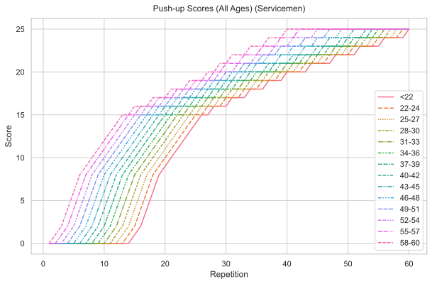 | 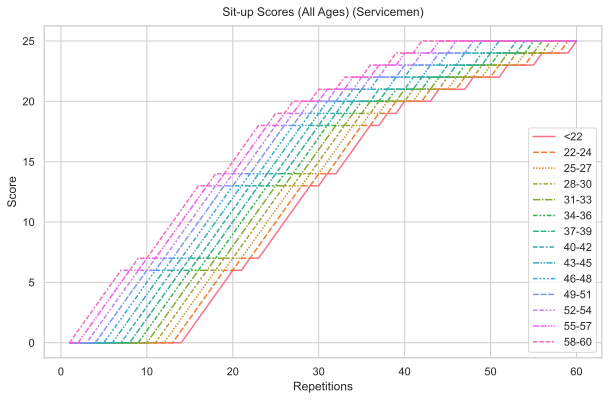 | 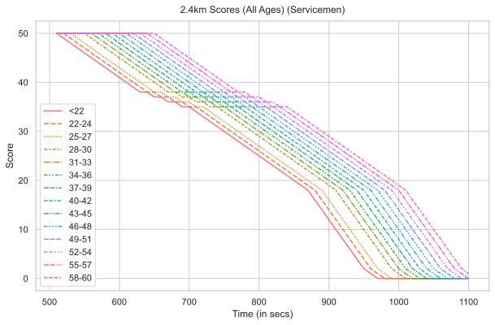 |

</details>

<details open>
<summary><b>Servicewomen Overall Trends</b></summary>

| Push-ups (All Ages) | Sit-ups (All Ages) | 2.4km Run (All Ages) |
| :---: | :---: | :---: |
| 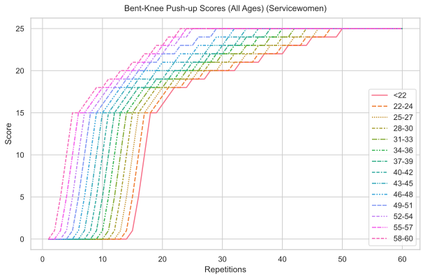 | 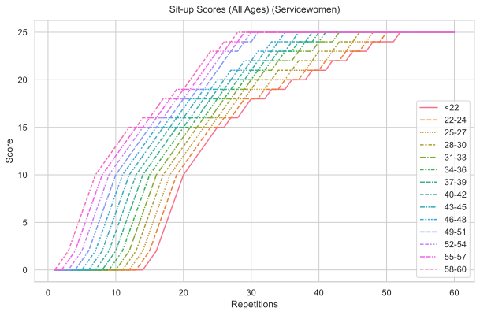 | 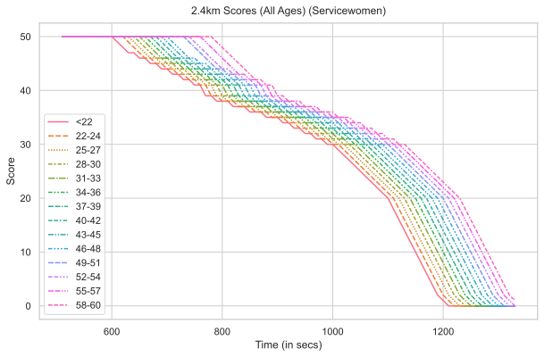 |

</details>

---

## 🎯 Score Trends by Age Category


<details>
<summary><b>Age 0–22 Score Trends (Under 22)</b> — <i>Click to expand</i></summary>

#### 👨 Servicemen (Under 22)

| Push-ups | Sit-ups | 2.4km Run |
| :---: | :---: | :---: |
| 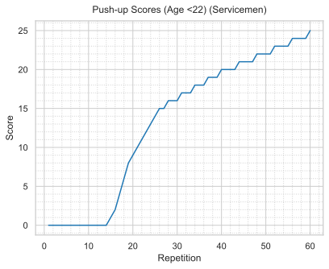 | 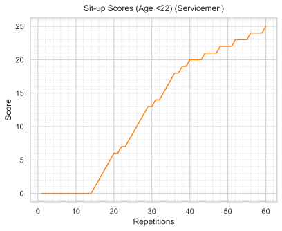 | 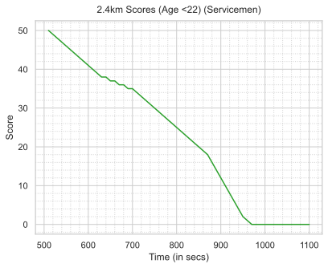 |

#### 👩 Servicewomen (Under 22)

| Push-ups | Sit-ups | 2.4km Run |
| :---: | :---: | :---: |
| 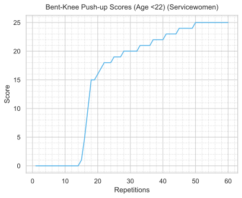 | 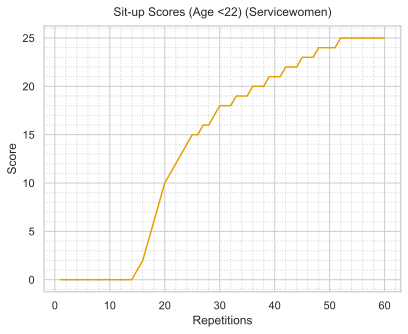 | 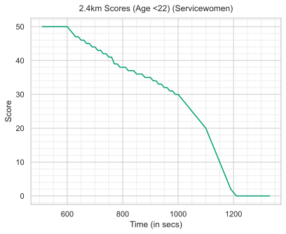 |

</details>


<details>
<summary><b>Age 22–24 Score Trends (Age 22 – 24)</b> — <i>Click to expand</i></summary>

#### 👨 Servicemen (Age 22 – 24)

| Push-ups | Sit-ups | 2.4km Run |
| :---: | :---: | :---: |
| 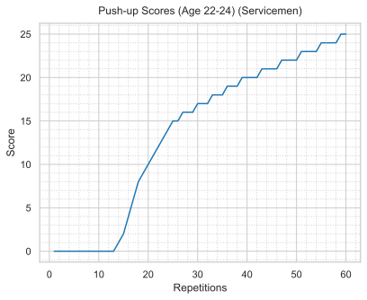 | 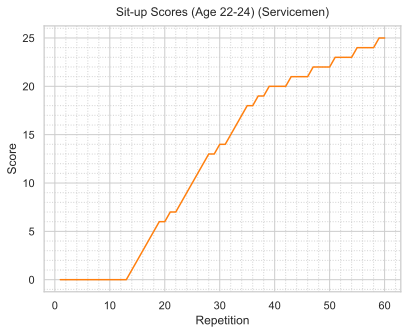 | 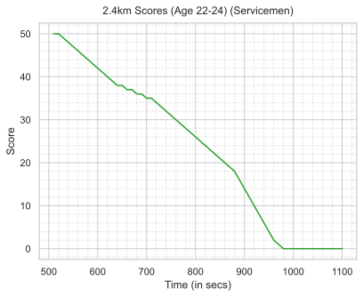 |

#### 👩 Servicewomen (Age 22 – 24)

| Push-ups | Sit-ups | 2.4km Run |
| :---: | :---: | :---: |
| 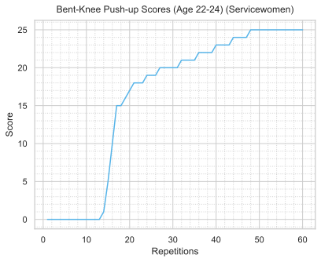 | 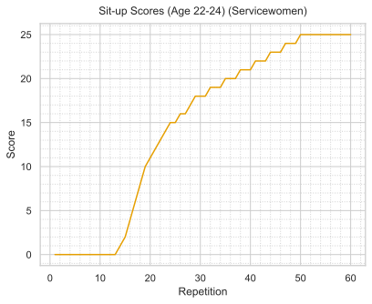 | 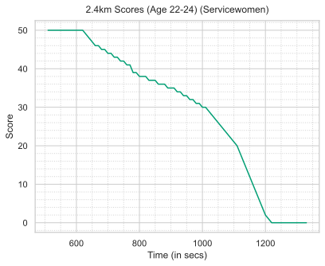 |

</details>


<details>
<summary><b>Age 25–27 Score Trends (Age 25 – 27)</b> — <i>Click to expand</i></summary>

#### 👨 Servicemen (Age 25 – 27)

| Push-ups | Sit-ups | 2.4km Run |
| :---: | :---: | :---: |
| 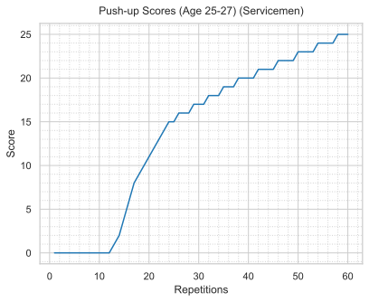 | 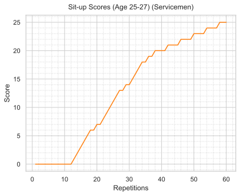 | 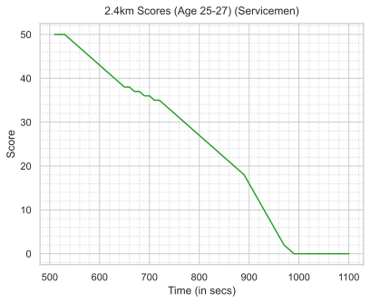 |

#### 👩 Servicewomen (Age 25 – 27)

| Push-ups | Sit-ups | 2.4km Run |
| :---: | :---: | :---: |
| 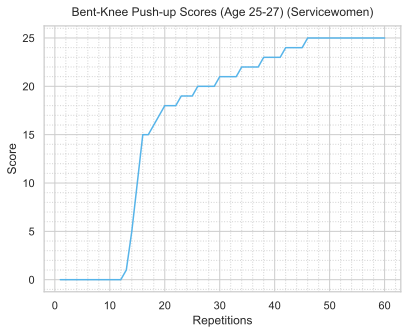 | 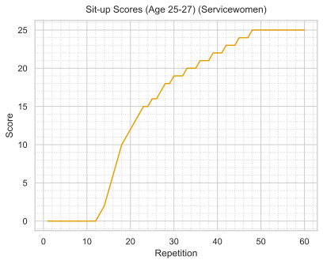 | 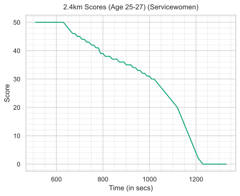 |

</details>


<details>
<summary><b>Age 28–30 Score Trends (Age 28 – 30)</b> — <i>Click to expand</i></summary>

#### 👨 Servicemen (Age 28 – 30)

| Push-ups | Sit-ups | 2.4km Run |
| :---: | :---: | :---: |
|  | 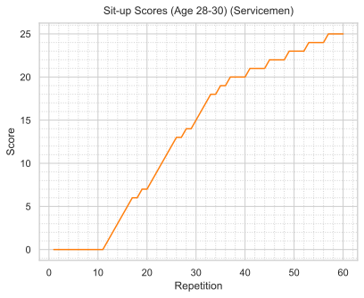 | 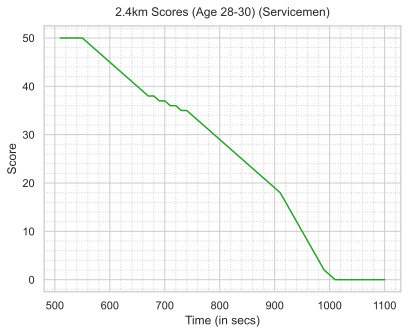 |

#### 👩 Servicewomen (Age 28 – 30)

| Push-ups | Sit-ups | 2.4km Run |
| :---: | :---: | :---: |
| 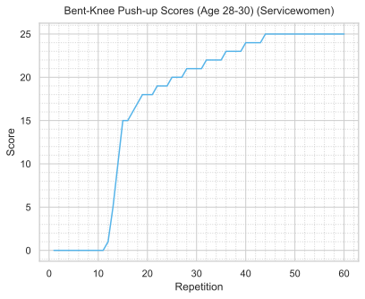 |  |  |

</details>


<details>
<summary><b>Age 31–33 Score Trends (Age 31 – 33)</b> — <i>Click to expand</i></summary>

#### 👨 Servicemen (Age 31 – 33)

| Push-ups | Sit-ups | 2.4km Run |
| :---: | :---: | :---: |
| 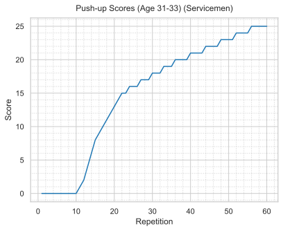 | 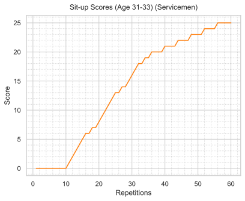 |  |

#### 👩 Servicewomen (Age 31 – 33)

| Push-ups | Sit-ups | 2.4km Run |
| :---: | :---: | :---: |
| 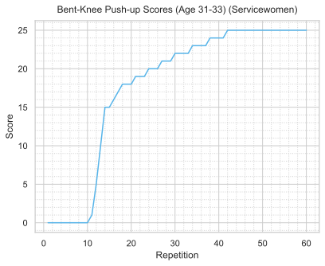 | 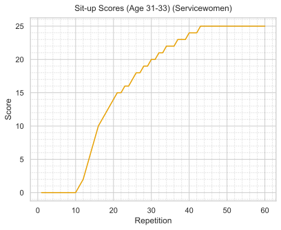 |  |

</details>


<details>
<summary><b>Age 34–36 Score Trends (Age 34 – 36)</b> — <i>Click to expand</i></summary>

#### 👨 Servicemen (Age 34 – 36)

| Push-ups | Sit-ups | 2.4km Run |
| :---: | :---: | :---: |
| 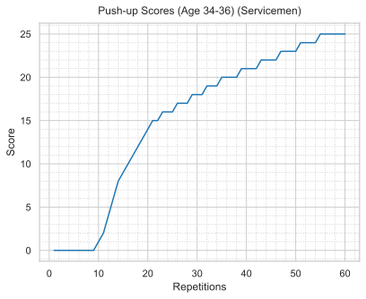 | 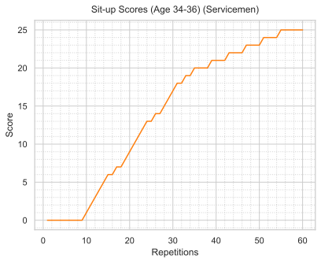 | 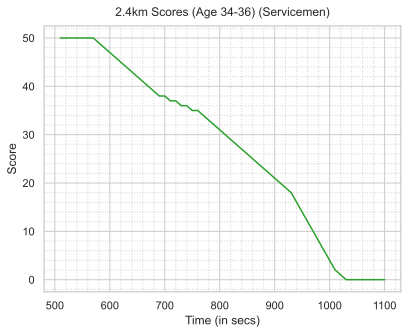 |

#### 👩 Servicewomen (Age 34 – 36)

| Push-ups | Sit-ups | 2.4km Run |
| :---: | :---: | :---: |
| 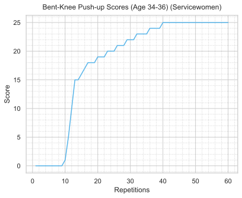 |  |  |

</details>


<details>
<summary><b>Age 37–39 Score Trends (Age 37 – 39)</b> — <i>Click to expand</i></summary>

#### 👨 Servicemen (Age 37 – 39)

| Push-ups | Sit-ups | 2.4km Run |
| :---: | :---: | :---: |
| 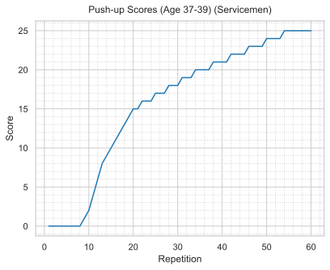 | 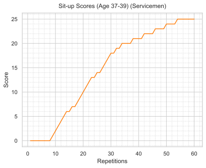 |  |

#### 👩 Servicewomen (Age 37 – 39)

| Push-ups | Sit-ups | 2.4km Run |
| :---: | :---: | :---: |
|  |  | 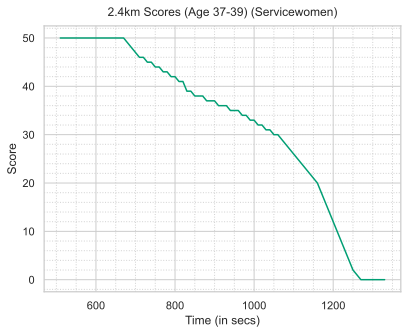 |

</details>


<details>
<summary><b>Age 40–42 Score Trends (Age 40 – 42)</b> — <i>Click to expand</i></summary>

#### 👨 Servicemen (Age 40 – 42)

| Push-ups | Sit-ups | 2.4km Run |
| :---: | :---: | :---: |
|  | 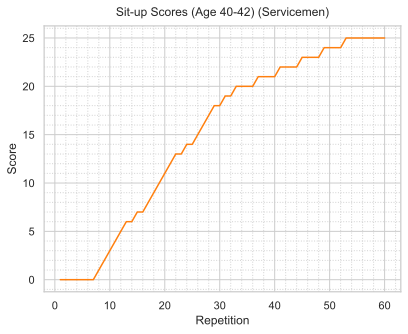 |  |

#### 👩 Servicewomen (Age 40 – 42)

| Push-ups | Sit-ups | 2.4km Run |
| :---: | :---: | :---: |
| 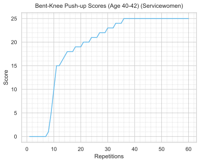 | 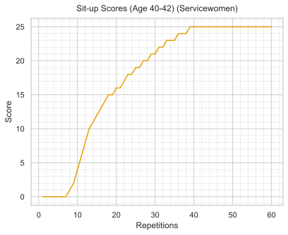 | 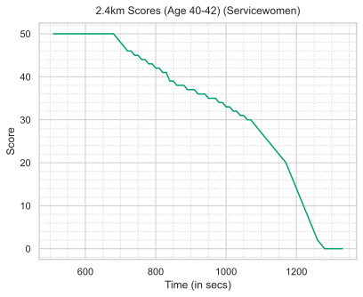 |

</details>


<details>
<summary><b>Age 43–45 Score Trends (Age 43 – 45)</b> — <i>Click to expand</i></summary>

#### 👨 Servicemen (Age 43 – 45)

| Push-ups | Sit-ups | 2.4km Run |
| :---: | :---: | :---: |
| 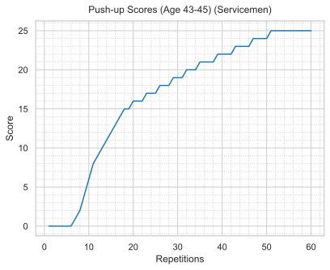 | 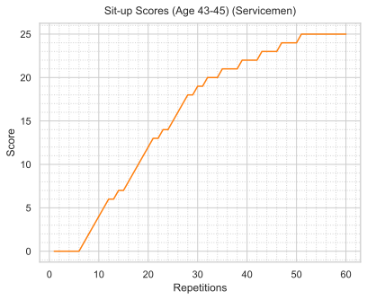 | 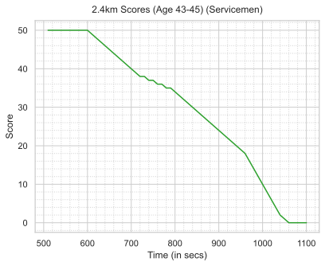 |

#### 👩 Servicewomen (Age 43 – 45)

| Push-ups | Sit-ups | 2.4km Run |
| :---: | :---: | :---: |
| 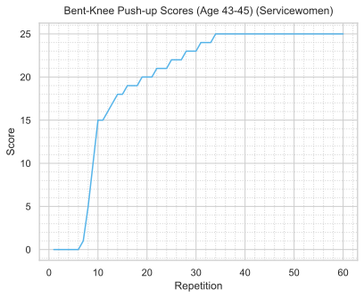 | 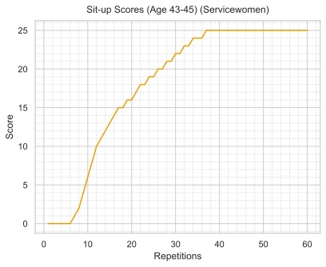 | 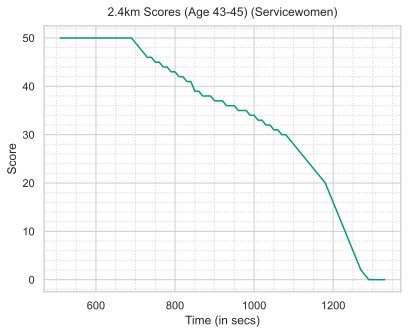 |

</details>


<details>
<summary><b>Age 46–48 Score Trends (Age 46 – 48)</b> — <i>Click to expand</i></summary>

#### 👨 Servicemen (Age 46 – 48)

| Push-ups | Sit-ups | 2.4km Run |
| :---: | :---: | :---: |
| 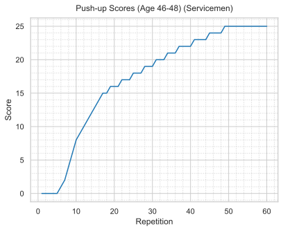 |  | 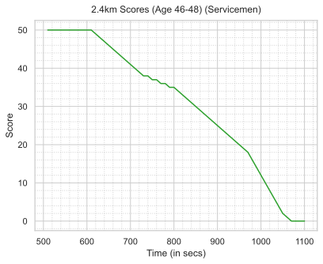 |

#### 👩 Servicewomen (Age 46 – 48)

| Push-ups | Sit-ups | 2.4km Run |
| :---: | :---: | :---: |
|  |  |  |

</details>


<details>
<summary><b>Age 49–51 Score Trends (Age 49 – 51)</b> — <i>Click to expand</i></summary>

#### 👨 Servicemen (Age 49 – 51)

| Push-ups | Sit-ups | 2.4km Run |
| :---: | :---: | :---: |
|  |  |  |

#### 👩 Servicewomen (Age 49 – 51)

| Push-ups | Sit-ups | 2.4km Run |
| :---: | :---: | :---: |
|  |  |  |

</details>


<details>
<summary><b>Age 52–54 Score Trends (Age 52 – 54)</b> — <i>Click to expand</i></summary>

#### 👨 Servicemen (Age 52 – 54)

| Push-ups | Sit-ups | 2.4km Run |
| :---: | :---: | :---: |
|  |  |  |

#### 👩 Servicewomen (Age 52 – 54)

| Push-ups | Sit-ups | 2.4km Run |
| :---: | :---: | :---: |
|  |  |  |

</details>


<details>
<summary><b>Age 55–57 Score Trends (Age 55 – 57)</b> — <i>Click to expand</i></summary>

#### 👨 Servicemen (Age 55 – 57)

| Push-ups | Sit-ups | 2.4km Run |
| :---: | :---: | :---: |
|  |  |  |

#### 👩 Servicewomen (Age 55 – 57)

| Push-ups | Sit-ups | 2.4km Run |
| :---: | :---: | :---: |
|  |  |  |

</details>


<details>
<summary><b>Age 58–60 Score Trends (Age 58 – 60)</b> — <i>Click to expand</i></summary>

#### 👨 Servicemen (Age 58 – 60)

| Push-ups | Sit-ups | 2.4km Run |
| :---: | :---: | :---: |
|  |  |  |

#### 👩 Servicewomen (Age 58 – 60)

| Push-ups | Sit-ups | 2.4km Run |
| :---: | :---: | :---: |
|  |  |  |

</details>

---

## 📌 Repository Features & Usage

### 📁 Repository Structure

```text
├── create-plots.py          # Python script to generate all SVG plots
├── plots/                   # Directory containing 90+ vector SVG plots
├── scores-pushup-men.csv    # Push-up score table for Servicemen
├── scores-pushup-women.csv  # Push-up score table for Servicewomen
├── scores-run-men.csv       # 2.4km run score table for Servicemen
├── scores-run-women.csv     # 2.4km run score table for Servicewomen
├── scores-situp-men.csv     # Sit-up score table for Servicemen
├── scores-situp-women.csv   # Sit-up score table for Servicewomen
├── pyproject.toml           # Project metadata and dependencies
└── uv.lock                  # UV package manager lockfile
```

### 🚀 Generating Plots

1. **Clone repository**:
   ```bash
   git clone https://github.com/your-username/ippt-charts.git
   cd ippt-charts
   ```

2. **Run Plot Generator**:
   Using `uv`:
   ```bash
   uv run create-plots.py
   ```
   Or standard `python`:
   ```bash
   pip install pandas seaborn matplotlib
   python create-plots.py
   ```

---

## 📊 Data Sources & References

- **MINDEF NS Portal**: [IPPT Stations and Scoring System](https://www.ns.gov.sg/web/profiles/nsman/ippt-and-ns-fit/ippt-stations-and-scoring-system)
- **IPPT.pro**: [https://ippt.pro/](https://ippt.pro/)

---

## 📜 License

This project is open-source. Please credit the original sources when referencing IPPT scoring tables.
